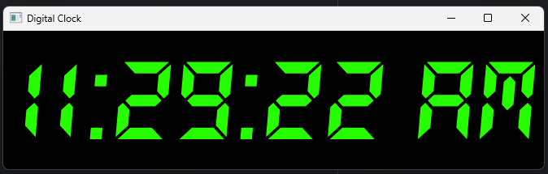
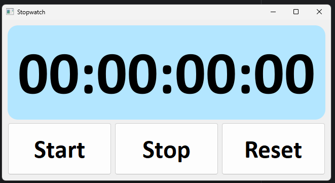
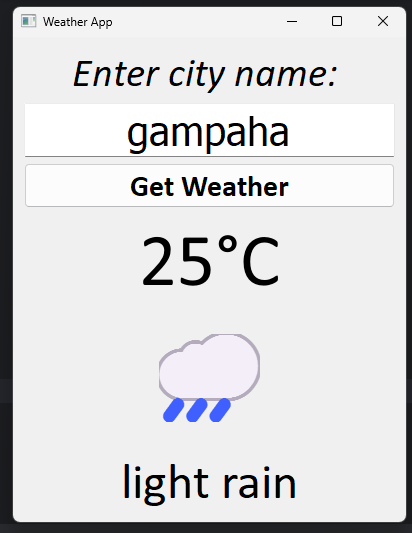

# 🐍 Python

---

## 🕒 Digital Clock
A real-time digital clock

🧠 Simple and beginner-friendly.

[🔗 View Code](https://github.com/nirmal-404/python/blob/main/10%20final%20projects/1_%E2%AD%90digital_clock_program%F0%9F%95%92.py)

---

## ⏱️ Stopwatch
A basic stopwatch with start, stop, and reset functionalities.

[🔗 View Code](https://github.com/nirmal-404/python/blob/main/10%20final%20projects/2_%E2%AD%90stopwatch_program%E2%8F%B1.py)

---

## ☁️ Weather App (API Based)
A weather app that fetches real-time weather data using an external API and displays it with a minimal UI.

[🔗 View Code](https://github.com/nirmal-404/python/blob/main/10%20final%20projects/3_%E2%AD%90weather_API_app%E2%98%80%EF%B8%8F.py)

🌐 Uses OpenWeatherMap API
